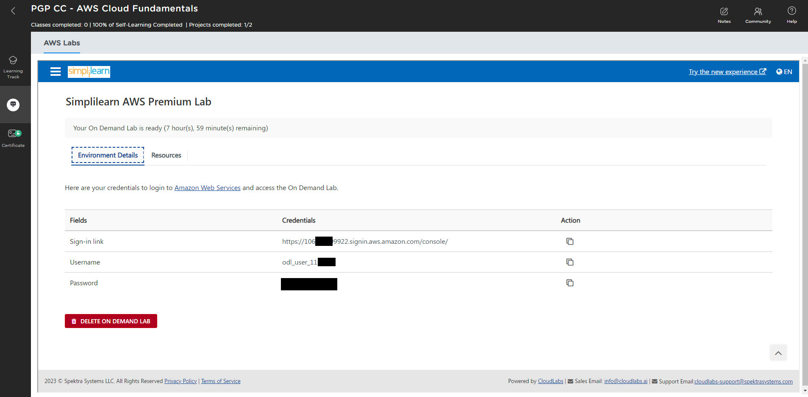

# Course: aws-cloud-fundamentals
This repository stores course write-ups for building the AWS labs assignments, on the AWS Cloud Fundamentals course.

# Classroom
Between 25/11/2023 and 09/12/2023 this course was taught via remote classrooms (Zoom) over 4-hour intervals, the course lasted a total of 24 hours, typically over a weekend.
Each Lesson was presented by our SimpliLearn trainer. On the course we covered the agenda of:
| Lesson | Title |
|---|---|
| 1 | Course Introduction |
| 2 | Introduction to Amazon Web Services |
| 3 | AWS Compute |
| 4 | AWS Networking |
| 5 | AWS Storage |
| 6 | AWS Databases |
| 7 | AWS Monitoring and Optimisation, and Serverless Architecture |
| 8 | AWS Security and Account Management |

At the end of each lesson, we all had lab-activities to perform, sometimes 3-4 per-lesson, each to be completed within our own time. 

Towards the end, we were given two project items, although only one was able to be submitted passing the course automatically via the Simplilearn LMS portal. 

## Access to AWS Labs
During the SimpliLearn Course we were given the opportunity to `create an AWS practice lab`, powered by [CloudLabs](https://cloudlabs.ai/). Starting one of these labs provides an `8-hour window` within which we can build/deploy/test almost anything, as long as we stick within the default region. We later found out this is also within the course-providers quota limits and approved regions.

We can simply start the practice lab, and then we will be presented with a login URL, iam_username and iam_password.  EG:


You can reach the AWS console here: https://console.aws.com

## Generating your Access Key
Login to the AWS Management Console (GUI)
Navigate to the AMI section
Select your current user
Select `create access key`, select command line, click accept to the agreement, and click save
Click the reveal icon to view the secret value. Save these credentials for later use

Note: I had to do this a couple of times as the lab is only available for 8-hours.

## Prepare AWS CLI
`aws cli` is a downloadable application that is required to be installed as follows:
> msiexec /i https://awscli.amazonaws.com/AWSCLIV2.msi

This installation registers the PATH parameter in windows, so re-launch your command line. and then configure the product using:
> aws configure

Enter the following parameters:
```
$env:AWS_ACCESS_KEY_ID="{REDACTED}"
$env:AWS_SECRET_ACCESS_KEY="{REDACTED}"
$env:AWS_REGION="us-east-1"
```

## Preparing Terraform
`Terraform` can be downloaded from [here](https://developer.hashicorp.com/terraform/downloads), select the operating system and follow the relevant installation instructions.  I'm using Windows, so simply download the ZIP, and extracted it to `C:\Program Files\Hashicorp\Terraform`.
I also updated the PATH variable in windows to reflect the installation path of terraform.

Terraform typically has a state file that we should save on a shared-aread, to be accessible by multiple people/services. For this course, this is not necessary, a local state-file, with no additional configuration, is all that is required.

## Projects
Tackling each of the assignments (mini-projects with real-world applicability) as their own distinct set of objectives/challanges; the folder structure in this repository represents each assignment. There is also a PDF extract off the course-downloadable-content, which gives all the details needed to start designing/building on AWS.
|Project | Name | Brief | Writeup |
|---|---|---|---|
| 0|Create a Static Website in an S3 Bucket with Public Access Policies|[Brief](Project%201%20-%20Creating%20a%20VPC%20with%20RDS%20DB%20and%20an%20EC2%20Instance.pdf)|[Readme](./Project%200/README.md)
| 1|Creating a VPC with RDS DB and an EC2 Instance|[Brief](Project%201%20-%20Creating%20a%20VPC%20with%20RDS%20DB%20and%20an%20EC2%20Instance.pdf)|[Readme](./Project%201/README.md)